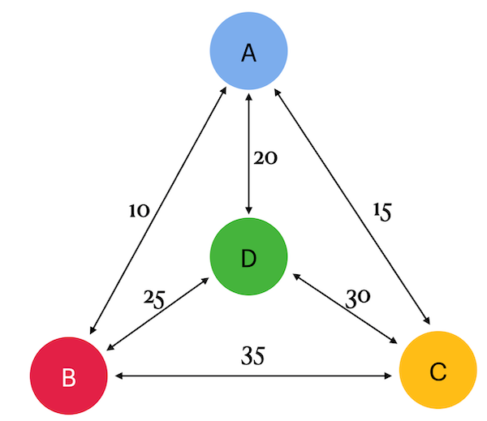

## Chapter II
## General Rules

- Use this page as the only reference. Do not listen to any rumors and speculations on how to prepare your solution.
- Please make sure you are using the latest version of PostgreSQL.
- That is completely OK if you are using IDE to write a source code (aka SQL script).
- To be assessed your solution must be in your GIT repository.
- Your solutions will be evaluated by your piscine mates.
- You should not leave in your directory any other file than those explicitly specified by the exercise instructions. It is recommended that you modify your `.gitignore` to avoid accidents.
- Do you have a question? Ask your neighbor on the right. Otherwise, try with your neighbor on the left.
- Your reference manual: mates / Internet / Google. 
- Read the examples carefully. They may require things that are not otherwise specified in the subject.
- And may the SQL-Force be with you!
- Absolutely everything can be presented in SQL! Let’s start and have fun!

## Chapter III
## Rules of the day

- Please make sure you have an own database and access for it on your PostgreSQL cluster. 
- All tasks contain a list of Allowed and Denied sections with listed database options, database types, SQL constructions etc. Please have a look at the section before you start.

## Chapter IV
## Exercise 00 - Classical TSP

| Exercise 00: Classical TSP|                                                                                                                          |
|---------------------------------------|--------------------------------------------------------------------------------------------------------------------------|
| Turn-in directory                     | ex00                                                                                                                     |
| Files to turn-in                      | `team00_ex00.sql` DDL for table creation with INSERTs of data; SQL DML statement                                                                                |
| **Allowed**                               |                                                                                                                          |
| Language                        | ANSI SQL|
| SQL Syntax Pattern                        | Recursive Query|

Please take a look at the Graph on the left. 
There are 4 cities (a, b, c and d) and arcs between them with cost (or taxination). Actually the cost (a,b) = (b,a).

Please create a table with name nodes by using structure {point1, point2, cost} and fill data based on a picture (remember there are direct and reverse paths between 2 nodes).
Please write one SQL statement that returns all tours (aka paths) with minimal traveling cost if we will start from city "a".
Just remember, you need to find the cheapest way of visiting all the cities and returning to your starting point. For example, the tour looks like that a -> b -> c -> d -> a.

The sample of output data you can find below. Please sort data by total_cost and then by tour.

| total_cost | tour |
| ------ | ------ |
| 80 | {a,b,d,c,a} |
| ... | ... |

## Chapter V
## Exercise 01 - Opposite TSP

| Exercise 01: Opposite TSP|                                                                                                                          |
|---------------------------------------|--------------------------------------------------------------------------------------------------------------------------|
| Turn-in directory                     | ex01                                                                                                                     |
| Files to turn-in                      | `team00_ex01.sql`     SQL DML statement                                                                             |
| **Allowed**                               |                                                                                                                          |
| Language                        | ANSI SQL|
| SQL Syntax Pattern                        | Recursive Query|

Please add a possibility to see additional rows with the most expensive cost to the SQL from previous exercise. Just take a look at the sample of data below. Please sort data by total_cost and then by tour.

| total_cost | tour |
| ------ | ------ |
| 80 | {a,b,d,c,a} |
| ... | ... |
| 95 | {a,d,c,b,a} |

